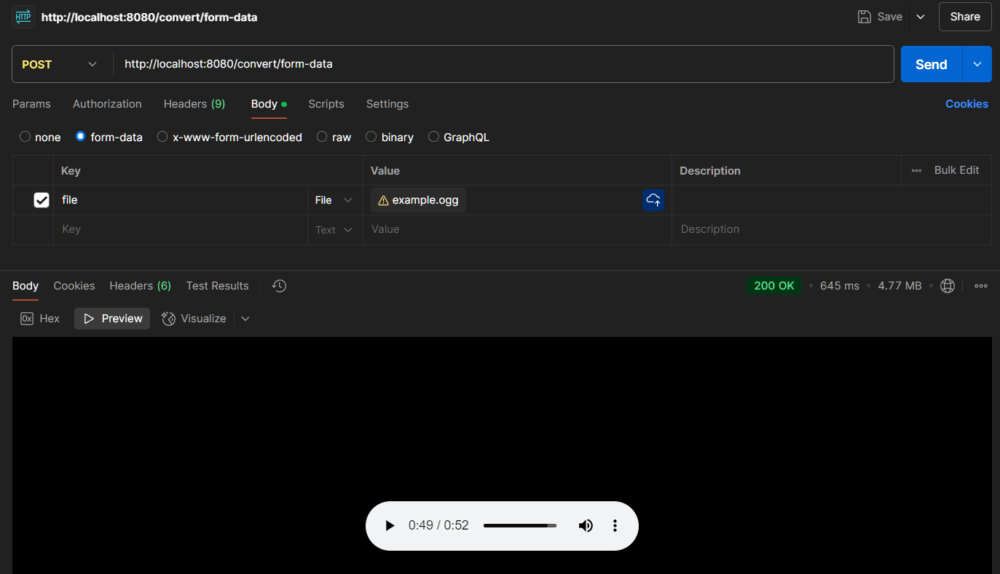

# Конвертер OGG в WAV

Это простое приложение на Flask, которое конвертирует аудиофайлы формата OGG в формат WAV. Приложение предоставляет два маршрута для загрузки и преобразования файлов:

1. **/convert/form-data** — для преобразования файла через form-data.
2. **/convert/bytes** — для преобразования .ogg данных в двоичном виде.

Приложение использует **FFmpeg** для преобразования аудиофайлов.

## Установка и запуск

### 1. Использования Docker-образа из Dockerhub


### 2. Создание и запуск Docker контейнера вручную

Для запуска приложения с помощью Docker выполните следующие шаги.

- Соберите Docker-образ из Dockerfile:

```bash
docker build -t ogg-to-wav .
```

- Запустите контейнер:

```bash
docker run -d -p 8080:8080 ogg-to-wav
```

Приложение будет доступно по адресу http://localhost:8080.

## API
- /convert/form-data — Принимает файл через form-data (Для проверки работы)

Пример запроса:



- /convert/bytes — Принимает и обрабатывает двоичные данные .ogg файла (Для предоставления API другим приложениям)